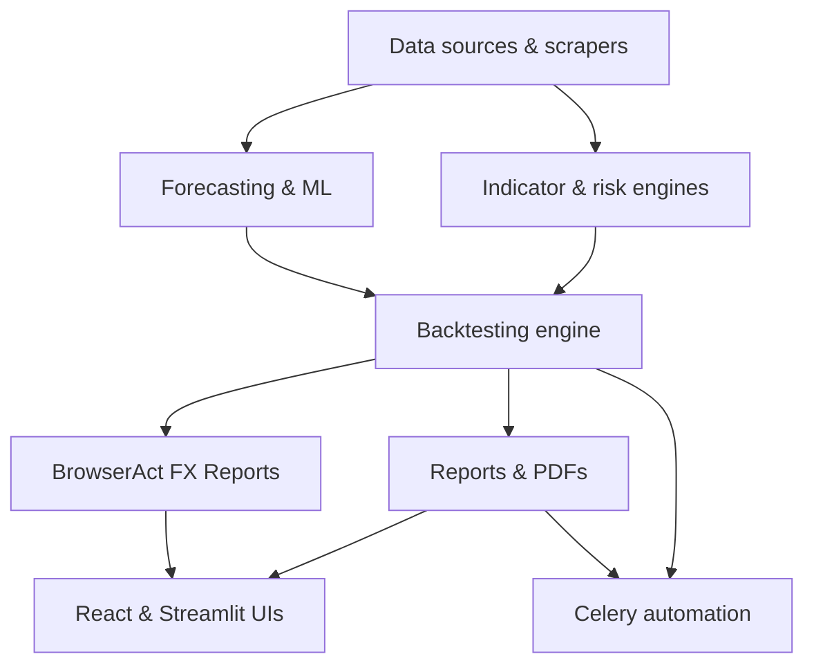

## Overview

The `trading-app-web` repository bundles a full trading analytics stack: multi-UI frontends, a backtesting and strategy engine, forecasting models, reporting pipelines, and background automation. This page orients you around the major feature areas and where to find them in the codebase.

<Columns cols={3}>
  <Card title="Strategy & Backtesting" icon="bar-chart" href="#strategy-and-backtesting">
    Design, backtest, and evaluate trading strategies using a shared engine and risk metrics.
  </Card>
  <Card title="Forecasting & ML" icon="zap" href="#forecasting-and-ml">
    Run Prophet, ARIMA, LSTM and other models for price forecasting and signal generation.
  </Card>
  <Card title="Reports & PDFs" icon="file-text" href="#reports-and-pdfs">
    Generate Documentero-powered report PDFs for strategies, portfolios, and FX analyses.
  </Card>
  <Card title="BrowserAct FX Reports" icon="code" href="#browseract-fx-reports">
    Produce BrowserAct FX web reports and APIs for FX-focused analysis.
  </Card>
  <Card title="Automation & Tasks" icon="settings" href="#automation-and-background-tasks">
    Orchestrate long-running jobs and pipelines via Celery workers and task queues.
  </Card>
  <Card title="Multi-UI Frontends" icon="monitor" href="#multi-ui-frontends">
    Combine React, Streamlit, and Electron frontends over a shared backend.
  </Card>
  <Card title="Data Sources & Scrapers" icon="database" href="#data-sources-and-scrapers">
    Ingest pricing and fundamental data from APIs, yfinance, and Playwright-based scrapers.
  </Card>
  <Card title="Indicator & Risk Engines" icon="shield" href="#indicator-and-risk-engines">
    Compute technical indicators and portfolio risk metrics as reusable services.
  </Card>
</Columns>

## Strategy and backtesting

Strategy and backtesting workflows live primarily in the `backtesting/` and `analysis/` modules, with Streamlit pages wiring them into interactive dashboards.

- Core engine: `backtesting/backtest_engine.py`
- Strategy construction: `analysis/strategy_builder.py`
- Streamlit workflows: `pages/1_Strategy_Centre.py`, `pages/3_Planner.py`

The backtesting engine accepts strategies built from indicator signals and risk rules, runs historical simulations, and outputs trade logs and performance curves. The strategy builder helps assemble those strategies from components so you can iterate quickly.

<Callout kind="info">
  Use the Strategy Centre page (`pages/1_Strategy_Centre.py`) for ad hoc exploration and validation, and the Planner page (`pages/3_Planner.py`) for more structured, scenario-based workflows.
</Callout>

## Forecasting and ML

Forecasting and machine learning features are integrated into the analysis pipeline for price prediction and signal generation. The repo supports:

- Prophet-based time series forecasting
- ARIMA-style classical models
- LSTM and similar neural network architectures

These models plug into the same data pipelines as the backtesting engine, so you can:

- Train models on historical price series
- Produce multi-step forecasts
- Feed forecast outputs into strategy rules and dashboards

<Callout kind="tip">
  Keep heavy ML dependencies in a dedicated environment when possible. The forecasting code is isolated so you can deploy it separately from lightweight web frontends if needed.
</Callout>

## Indicator and risk engines

Technical indicators and risk metrics are implemented as dedicated services under `services/`:

- Indicator engine: `services/indicator_calculation_engine.py`
- Risk metrics: `services/risk_metrics_service.py`

The indicator engine computes a range of time-series indicators (moving averages, oscillators, and similar constructs) that strategies and dashboards reuse. The risk service exposes portfolio-level metrics such as drawdown, volatility, and risk-adjusted returns, which the backtesting engine can call directly.

These services are designed to be stateless and composable, so you can:

- Reuse them across Streamlit, React, and automation workflows
- Swap data sources while keeping risk/indicator logic unchanged
- Extend with custom indicators or metrics in a single place

## Reports and PDFs

Reporting functionality builds on Documentero to generate structured outputs from backtests, risk metrics, and forecasts.

Key locations:

- Document generation logic: Documentero integration modules
- Strategy and portfolio reports: reporting scripts that pull from backtesting and services
- PDF export plumbing: pipeline that renders HTML-like templates and exports to PDF

Reports typically include:

- Strategy descriptions and configuration snapshots
- Performance charts and tables derived from backtest results
- Risk metric summaries and forecast visualizations

<Callout kind="info">
  Use the same report definitions for both ad hoc exports (from Streamlit or React UIs) and scheduled runs triggered by Celery tasks, which keeps visual formats consistent across manual and automated workflows.
</Callout>

## BrowserAct FX Reports

BrowserAct FX reports are a dedicated path for FX-focused analytics, surfacing as both a React route and backend API.

- Frontend page: `frontend/src/pages/BrowserAct.tsx`
- Backend route: `api/routes/browseract_reports.py`

The React page lets users configure FX report parameters (currency pairs, horizons, models) and then calls the backend to generate BrowserAct-style reports. The API route orchestrates data retrieval, indicator and risk calculations, and report rendering.

<Callout kind="tip">
  For a deeper walkthrough of this flow, including example payloads and response formats, see the [BrowserAct FX Reports](/browseract-reports) page.
</Callout>

The BrowserAct pipeline reuses the same engines as the rest of the app, so improvements to the backtesting, indicator, or risk services automatically flow into FX reporting.

## Automation and background tasks

Automation and long-running workflows rely on Celery, configured at the repo root and wired into data and reporting services.

Key components:

- Celery app configuration: `celery_app.py`
- Task definitions: `tasks/` modules
- Integration points: reporting, scraping, and analysis services

Typical background tasks include:

- Scheduling recurring backtests or forecasts
- Generating and emailing PDF or BrowserAct FX reports
- Running large data ingestions or scrapes outside request-response cycles

<Callout kind="info">
  Expect some Celery tasks to be long-running, especially full-universe backtests or multi-symbol scrapes. Configure worker concurrency and timeouts according to your deployment environment to avoid premature termination.
</Callout>

## Multi-UI frontends

The repository supports multiple user interfaces over the same trading and analytics backend:

- React web app (for rich browser-based workflows)
- Streamlit dashboards (for exploratory analysis and research)
- Electron wrapper (for a desktop-like experience when needed)

React UI modules live under `frontend/src/`, including the BrowserAct FX page and other views. Streamlit pages live in the `pages/` directory, such as `pages/1_Strategy_Centre.py` and `pages/3_Planner.py`, providing high-level entry points into strategy and planning workflows. The Electron shell wraps the web app when you want an installable desktop artifact.

<Callout kind="tip">
  Treat Streamlit and Electron as optional frontends. You can deploy only the React app and backend APIs in production environments while keeping Streamlit pages for internal research or prototyping.
</Callout>

## Data sources and scrapers

Data ingestion combines third-party APIs, Python libraries, and a Playwright-based scraper for flexibility across vendors and asset classes.

Main sources:

- Playwright scraper: `api/services/tvs/tvs_scraper.py`
- Public and commercial APIs: AlphaVantage, EODHD, and similar connectors
- Library-based feeds: `yfinance` for equity and ETF data

The TVS scraper uses Playwright to collect structured data from web sources, then normalizes it into the same schema used by API-based feeds. Higher-level services treat all these sources uniformly, so you can:

- Switch providers with minimal changes to analysis code
- Combine multiple feeds for coverage and redundancy
- Feed identical data into backtesting, forecasting, and reporting pipelines

<Callout kind="info">
  Keep API keys and scraping credentials outside the repository in environment variables or a secrets manager. The ingestion services are written to read configuration from environment-focused settings so you can adapt them per deployment.
</Callout>

## How these pieces fit together

The trading-app-web architecture centers on shared engines and services, with multiple frontends and automation pathways on top.

This shared-core approach lets you choose how to expose functionality: interactive dashboards for researchers, BrowserAct FX web reports for FX teams, or automated pipelines for scheduled analytics, all backed by the same trading logic.