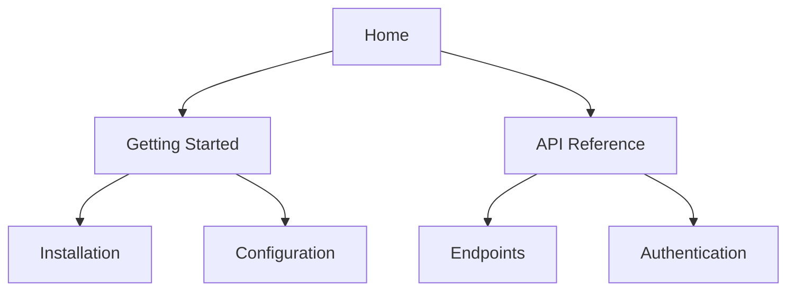

## Overview

CJL_Org provides powerful features to help you build and manage comprehensive documentation. You can organize content hierarchically, collaborate in real-time, track changes with version history, and find information quickly using search and tags. These tools make it easy to maintain professional-grade docs for your projects.

<Columns cols={2}>
  <Card title="Hierarchy & Organization" icon="layers" href="#hierarchy">
    Structure your docs like a book with nested pages and folders.
  </Card>
  <Card title="Real-time Collaboration" icon="users" href="#collaboration">
    Edit documents simultaneously with your team.
  </Card>
  <Card title="Version Control" icon="git-branch" href="#version-control">
    Track every change and revert when needed.
  </Card>
  <Card title="Search & Tagging" icon="search" href="#search-tagging">
    Quickly locate content with advanced filters.
  </Card>
</Columns>

## Document Hierarchy and Organization

Organize your documentation into a clear structure using nested pages and folders. This mirrors a table of contents, making navigation intuitive for readers.



<Steps>
  <Step title="Create Folders" icon="folder">
    In the sidebar, click `New Folder` and name it, such as `guides`.
  </Step>
  <Step title="Add Pages" icon="file-text">
    Right-click a folder and select `New Page`. Use markdown for content.
  </Step>
  <Step title="Reorder" icon="move">
    Drag pages to nest them under parents for automatic hierarchy.
  </Step>
</Steps>

<Callout kind="tip">
  Use frontmatter in pages for custom metadata like `sidebar_position: 1` to control order.
</Callout>

## Real-time Collaboration Editing

Invite team members to edit documents simultaneously. Changes appear instantly, with cursors showing who is editing where.

<Tabs>
  <Tab title="Invite Collaborators" icon="user-plus">
    Go to document settings and add emails. Collaborators get edit links.
  </Tab>
  <Tab title="Live Comments" icon="message-circle">
    Highlight text and add comments. Resolve them as a team.
  </Tab>
</Tabs>

```javascript
// Example: Share via API
const shareDoc = async (docId, userEmail) => {
  const response = await fetch(`https://api.example.com/docs/${docId}/share`, {
    method: 'POST',
    headers: { 'Authorization': `Bearer ${YOUR_API_KEY}` },
    body: JSON.stringify({ email: userEmail, role: 'editor' })
  });
  return response.json();
};
```

## Version Control and History Tracking

Every edit creates a commit-like snapshot. View diffs, restore versions, or compare changes.

<Expandable title="View History" default-open="true">
  Click the history icon on any page. Select versions to see side-by-side diffs.

  ```diff
  - Old: Welcome to v1.0
  + New: Welcome to v2.0 with new features
    Unchanged: Core functionality remains the same.
  ```
</Expandable>

<Steps>
  <Step title="Revert Changes" icon="undo">
    Open history, select a version, and click `Restore`.
  </Step>
  <Step title="Compare" icon="git-compare">
    Choose two versions to highlight additions and deletions.
  </Step>
</Steps>

## Advanced Search and Tagging

Search across all documents with filters for tags, dates, and authors. Add tags like `api`, `tutorial` for better organization.

| Feature       | Description                          | Example Tags          |
|---------------|--------------------------------------|-----------------------|
| Full-Text     | Searches titles and content          | `auth`, `setup`       |
| Tag Filter    | Narrow by multiple tags              | `api`, `v2.0`         |
| Advanced      | Boolean search: `auth AND setup`     | `deprecated`, `beta`  |

<CodeGroup tabs="CLI,API">
  ```bash
  # Add tag via CLI
  cjl-org tag add --doc-id 123 --tags "feature,beta"
  ```
  ```javascript
  // Add tags via API
  await fetch('https://api.example.com/docs/123/tags', {
    method: 'POST',
    body: JSON.stringify({ tags: ['feature', 'beta'] })
  });
  ```
</CodeGroup>

<Callout kind="info">
  Tags sync across your workspace, enabling global filtering in searches.
</Callout>

These features work together to streamline your documentation workflow. Start by organizing your hierarchy, then invite collaborators to build content efficiently.