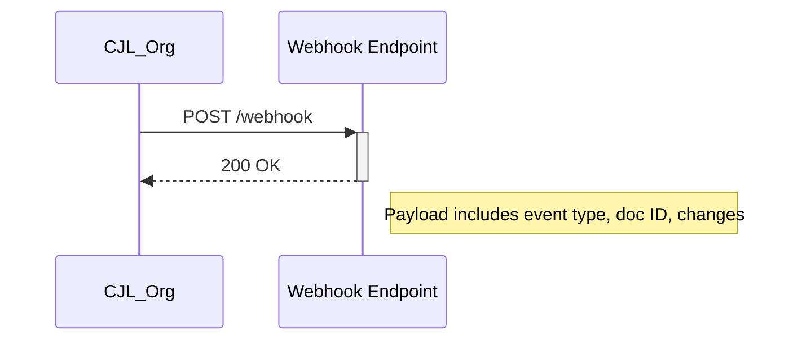

## Overview

CJL_Org supports a variety of integrations to enhance your documentation workflows. Connect to version control systems for automatic syncing, embed third-party apps, set up webhooks for real-time notifications, and handle exports and imports in multiple formats. These integrations help you maintain up-to-date documentation without manual effort.

<Callout kind="tip">
Start with GitHub sync for the most common use case, then explore webhooks for custom notifications.
</Callout>

## Key Integrations

Use these popular integrations to supercharge your CJL_Org setup.

<Columns cols={2}>
  <Card title="GitHub Sync" icon="github" href="#github-sync">
    Automatically sync documentation changes with your GitHub repositories.
  </Card>
  <Card title="Webhook Notifications" icon="zap" href="#webhooks">
    Receive instant alerts on documentation updates via webhooks.
  </Card>
  <Card title="Third-Party Embeds" icon="globe" href="#embeds">
    Embed tools like Figma, Jira, or Slack directly into your docs.
  </Card>
  <Card title="Export/Import" icon="upload" href="#export-import">
    Export docs to PDF, Markdown, or import from various sources.
  </Card>
</Columns>

## GitHub and Version Control Sync

Sync your CJL_Org documentation with GitHub repositories to enable version control and collaborative editing.

### Setup Steps

<Steps>
  <Step title="Connect Repository" icon="github">
    Navigate to Settings > Integrations in your CJL_Org dashboard.
    
    Select GitHub and authorize the app.
  </Step>
  <Step title="Configure Sync" icon="settings">
    Choose the repository and branch to sync (e.g., `main`).
    
````bash
# Example sync command after setup
cjl-org sync --repo owner/repo --branch main
````
  </Step>
  <Step title="Verify Sync" icon="check-circle">
    Push a change to GitHub and confirm it appears in CJL_Org.
  </Step>
</Steps>

<CodeGroup tabs="JavaScript,Python">
````javascript
// Pull latest changes via API
const response = await fetch('https://api.example.com/docs/sync/github', {
  method: 'POST',
  headers: { 'Authorization': 'Bearer YOUR_TOKEN' },
  body: JSON.stringify({ repo: 'owner/repo', branch: 'main' })
});
````
````python
import requests

response = requests.post(
    'https://api.example.com/docs/sync/github',
    headers={'Authorization': 'Bearer YOUR_TOKEN'},
    json={'repo': 'owner/repo', 'branch': 'main'}
)
````
</CodeGroup>

## Webhook Setup for Notifications

Set up webhooks to notify external services when documentation changes occur.

### Webhook Payload



<Tabs>
  <Tab title="Slack" icon="message-circle">
    Configure your Slack incoming webhook URL.
    
    <ParamField header="X-CJL-Signature" param-type="string" required="true">
      HMAC signature for payload verification.
    </ParamField>
    
````javascript
// Verify signature in Node.js
const crypto = require('crypto');
const signature = 'sha256=' + crypto.createHmac('sha256', 'YOUR_WEBHOOK_SECRET')
  .update(payload)
  .digest('hex');
````
  </Tab>
  <Tab title="Custom Endpoint" icon="server">
    Handle events like `doc.updated` or `doc.published`.
    
    <ResponseField name="event" field-type="string">
      Type of event triggered.
    </ResponseField>
    
````javascript
app.post('/webhook', (req, res) => {
  if (req.body.event === 'doc.updated') {
    // Handle update
  }
  res.status(200).send('OK');
});
````
  </Tab>
</Tabs>

## Third-Party App Embeddings

Embed external content seamlessly.

Use iframe embeds for apps like Figma or Google Docs.

```
Supported formats: iframe, oEmbed
Max size: `<1200px` width
```

Example:

```html
<iframe src="https://www.figma.com/embed?embed_host=share&url=https://www.figma.com/file/ABC123" width="600" height="450"></iframe>
```

## Export and Import Formats

Manage your documentation portability.

| Format     | Export | Import | Use Case                  |
|------------|--------|--------|---------------------------|
| Markdown  | ✅     | ✅     | GitHub sync, blogs        |
| PDF       | ✅     | ❌     | Printing, sharing         |
| HTML      | ✅     | ✅     | Web publishing            |
| JSON      | ✅     | ✅     | API backups               |

<Expandable title="Advanced Export Options" default-open="false">
Customize exports with filters:
- Include/exclude sections
- Theme selection
- Metadata injection
</Expandable>

<Callout kind="success">
Integrations streamline your workflow. Test webhooks in a staging environment first.
</Callout>